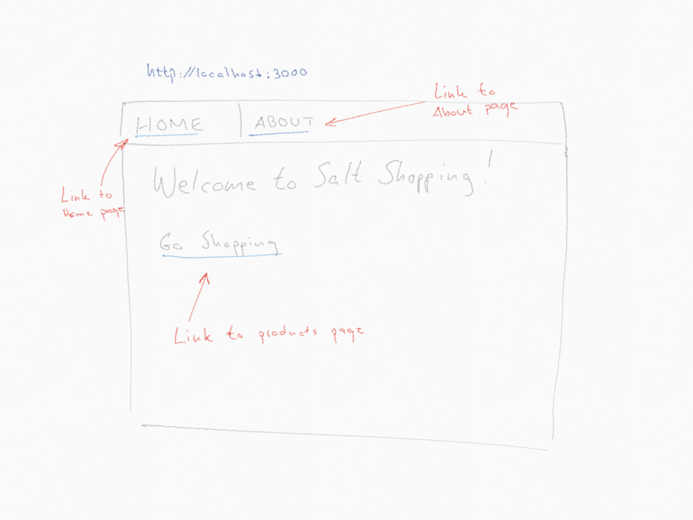
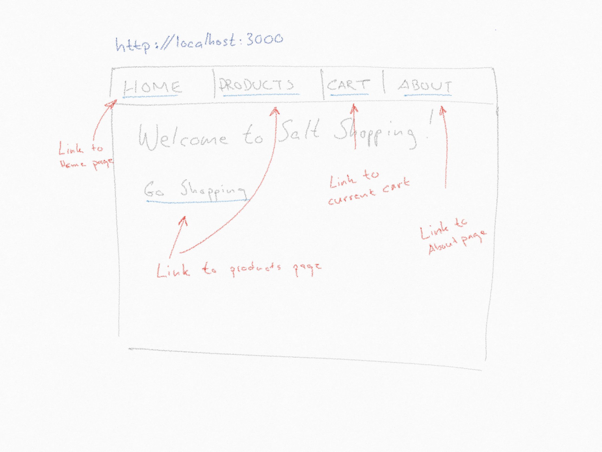
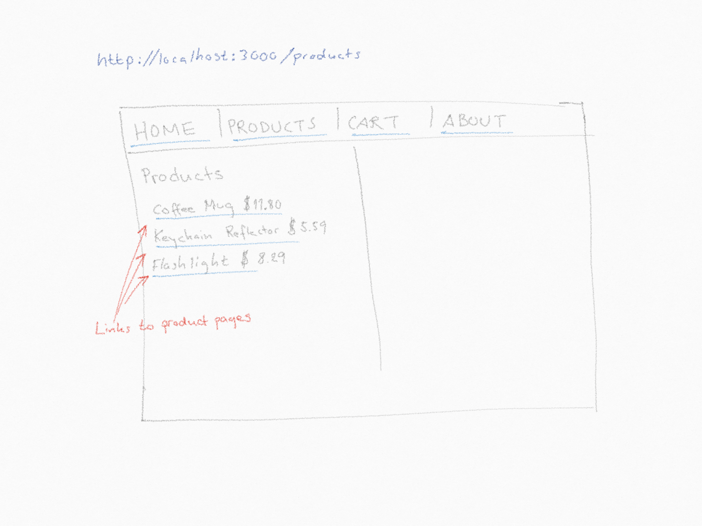
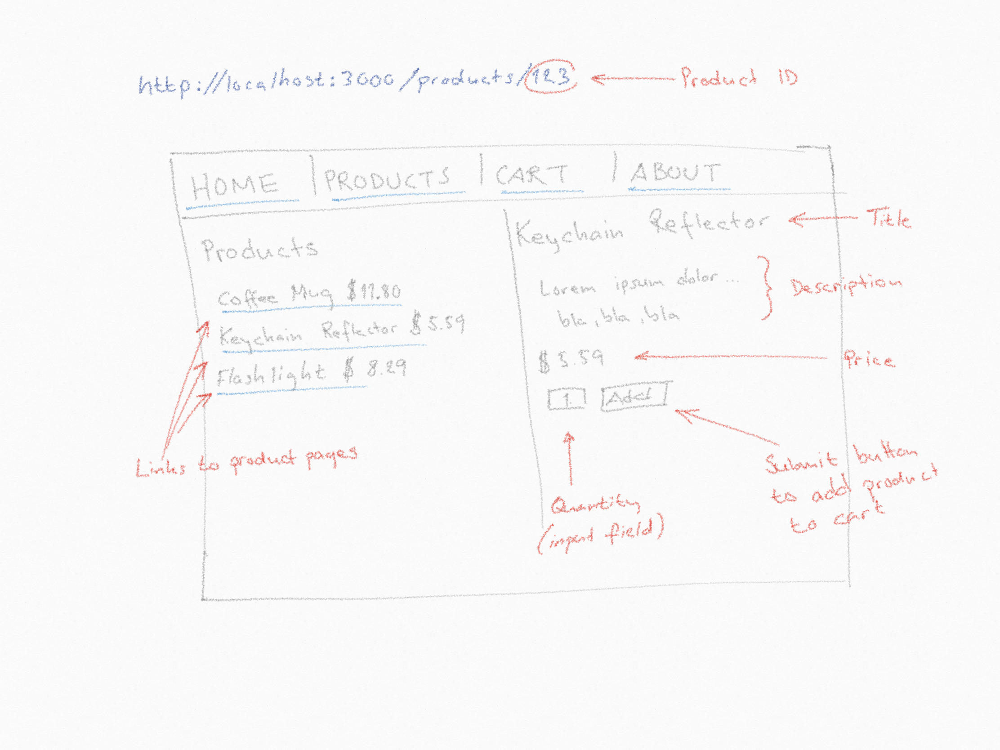
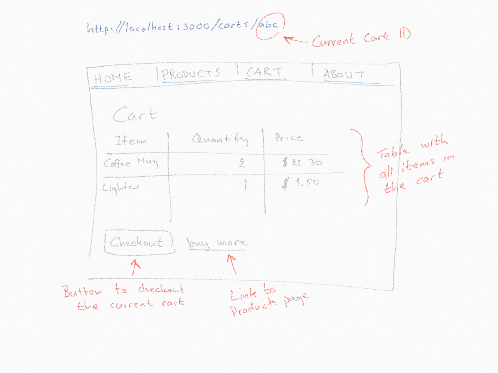
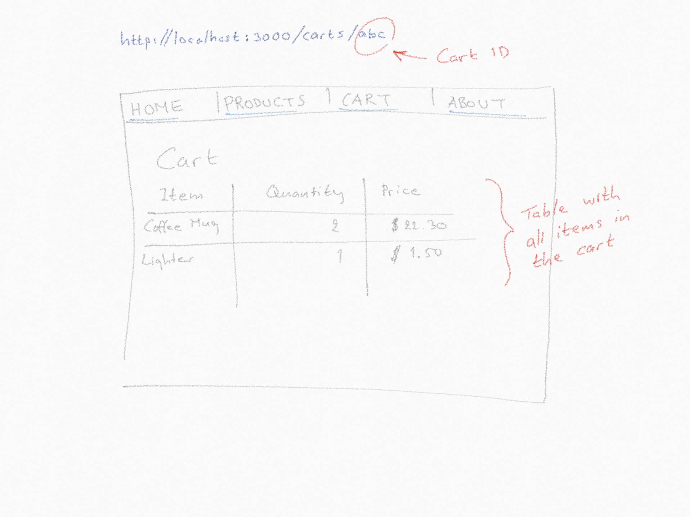
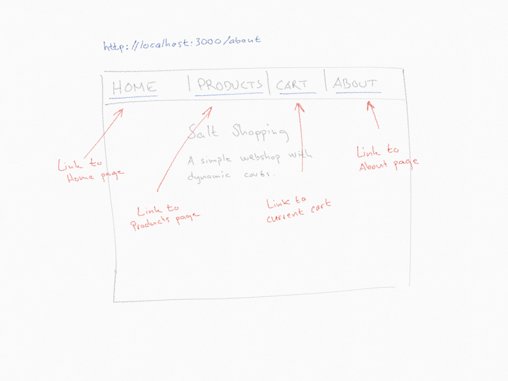

# Salt shopping - UI

In this exercise you will improve your webshop UI and make it responsive. 

Add media queries to handle at least 3 different screen sizes (usually mobile, tablet and desktop) and subtle animations to make your interactive parts (buttons etc) pop.

The desktop layout should look like the wireframes below, but for smaller screens make sure the menu and product lists are displayed in a way to make them easily accessible.

Remember to make your Ui mobile-first, have sensible defaults,  use a good css-reset and, as always, write your own css (i.e do not use boostrap or any other styling framework) 

### Home Page

When a user enters the page for the first time, he/she should be presented with a top menu that contains links to the home/index page and an about page.
On the home page there should be a link to the web shop. Clicking that link should open a new session and take the user to the products page.

### Session

When a session is opened up, a new `cart` should be attached to the session. The top menu should also show links to the products page and to the current cart.

### Products

The products page should list all products in the database. The product names are all links pointing to a page for each item.

In a real world app, where whould probably be meny products in the database and the API would have support pagination. However, that's out of the scope of this exercise.

Clicking a product link should open up a product view to the right of the products list.
The Product page contains `Title`, `Description` and `Price`. It also lets the user add the product to the cart.

### Cart

The cart page should list all items added to the cart. It should have a _checkout button_ and a link back to the porducts page.

When the cart has been checked out, it should no longer be reachable from the UI, but the link to the page should still be valid. However checkout button and link to the products page should be removed from the cart view.

### About

The about page is a static page with some information about the shop. You are free to add whatever info you want to this page. But the top menu links must follow the session. That means that the products and carts links hould only be present if the user has started a new session and the session is active.

